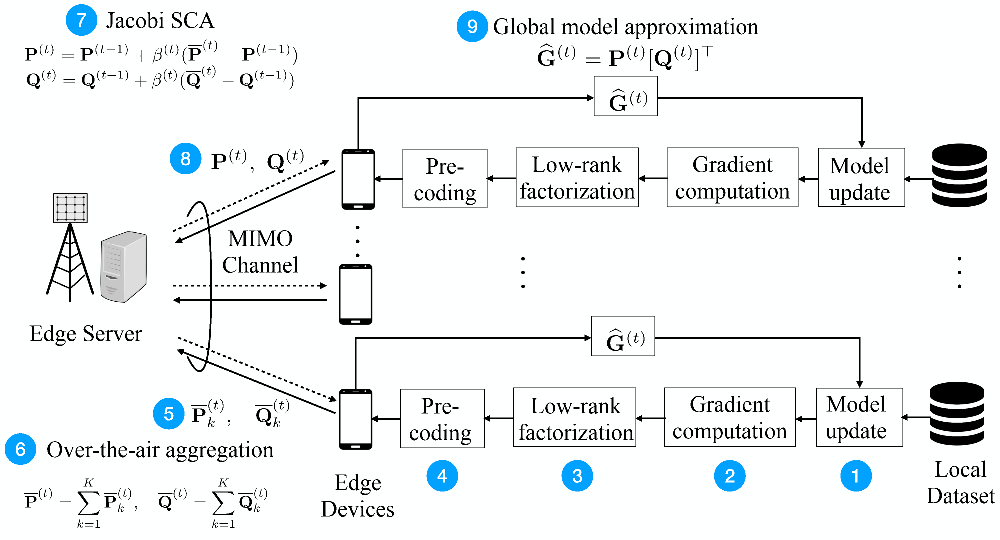

# Ota-LC
This is the code of the paper "Efficient Wireless Federated Learning via Low-Rank Gradient Factorization". [[paper]](https://arxiv.org/html/2401.07496v1)

{:height="60%" width="60%"}

## Requirements

To install requirements:
```
pip install -r requirements.txt
```

## Datasets

We use MNIST and CIFAR10 datasets for experimants, please download and unzip data under `data/` directory.

## Run the code

The `src` directory contains the source code for entire project. The training code is in `src/main_fed.py`. And the defalt setting of arguments is in `src/utils/options.py`.

For example, you can execute the following command:
```
python main_fed.py --mode ota_lc --C 0.1 --Nt 4 --Nr 8 --SNRdB 10
``` 

After the experient, the results will be saved in `/src/outputs/` directory.